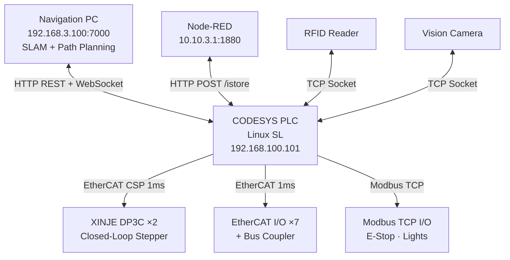
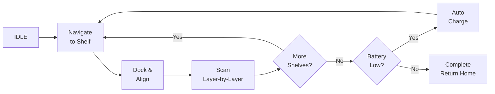

# Library Book Inventory AGV — Real-Time Motion Control System

> Autonomous guided vehicle for automated library bookshelf inventory using RFID + machine vision, built on CODESYS V3.5 with SoftMotion and EtherCAT fieldbus.

## Overview

This project implements the complete PLC control system for a library inventory AGV robot that autonomously navigates between bookshelves, positions a vertical scanning mechanism at each shelf layer, and reads book RFID tags combined with machine vision for stocktaking.

The system controls:
- **Dual-axis closed-loop stepper drives** (XINJE DP3C-L) via EtherCAT in Cyclic Synchronous Position (CSP) mode at 1ms cycle time
- **Multi-protocol communication**: EtherCAT real-time fieldbus, Modbus TCP I/O, HTTP REST API, WebSocket, raw TCP
- **Autonomous task scheduling**: area-based inventory planning, layer-by-layer scanning, automatic charging management
- **Three independent sensor subsystems**: RFID reader, machine vision camera, scanning mechanism controller

### Key Specifications

| Parameter | Value |
|-----------|-------|
| **PLC Platform** | CODESYS Control for Linux SL V4.6 |
| **Motion Library** | CODESYS SoftMotion V4.15 (29 libraries) |
| **Fieldbus** | EtherCAT with Distributed Clock synchronization |
| **Drive Protocol** | CiA 402 / DS402 — Cyclic Synchronous Position (CSP) |
| **Interpolation Cycle** | 1ms |
| **EtherCAT Slaves** | 10 devices (2 stepper drives + 7 I/O terminals + 1 bus coupler) |
| **Communication Protocols** | EtherCAT CoE, Modbus TCP, HTTP REST, WebSocket, TCP Socket |
| **HMI** | CODESYS Web Visualization (HTML5) |
| **User-Defined POUs** | 37 program organization units |
| **Compiled Libraries** | 179 dependencies |

---

## System Architecture

## Workflow

## Source Code (IEC 61131-3 Structured Text)

Representative ST code illustrating key control patterns. See [`src/README.md`](src/README.md) for details.

| File | Lines | Description |
|------|-------|-------------|
| [`AgvControl_FB.st`](src/agv_control/AgvControl_FB.st) | ~280 | Master AGV state machine — full IDLE→Navigate→Scan→Charge cycle |
| [`AxisControl_FB.st`](src/motion/AxisControl_FB.st) | ~200 | Single-axis motion controller wrapping 10 MC_ function blocks |
| [`NavigationApiClient.st`](src/communication/NavigationApiClient.st) | ~170 | HTTP REST client with JSON body construction |
| [`SensorTcpClient.st`](src/communication/SensorTcpClient.st) | ~170 | TCP socket client for RFID/Vision with reconnection logic |
| [`GVL_Servo.st`](src/global_variables/GVL_Servo.st) | ~80 | Axis configuration — limits, presets, runtime status |
| [`GVL_Main.st`](src/global_variables/GVL_Main.st) | ~70 | Core application variables — waypoints, tasks, diagnostics |
| [`St_PointAxis.st`](src/data_types/St_PointAxis.st) | ~80 | Data types — waypoint struct, state enums, shelf config |

## Documentation

| Document | Description |
|----------|-------------|
| [System Architecture](docs/system-architecture.md) | Full network topology, hardware layout, software stack |
| [Motion Control](docs/motion-control.md) | SoftMotion configuration, DS402 state machine, trajectory planning |
| [EtherCAT Configuration](docs/ethercat-configuration.md) | Bus topology, PDO mapping, XINJE DP3C drive setup |
| [Communication Protocols](docs/communication-protocols.md) | REST API endpoints, WebSocket, TCP, Modbus mapping |
| [State Machine](docs/state-machine.md) | AGV control flow, inventory scanning algorithm |
| [Safety Design](docs/safety-design.md) | E-Stop architecture, fault handling, axis protection |
| [HMI Interface](docs/hmi-interface.md) | Complete HMI variable reference (67 variables) |

## Configuration Files

| File | Description |
|------|-------------|
| [XINJE DP3C ESI](config/xinje-dp3c-esi.xml) | EtherCAT Slave Information file for the stepper drive |
| [XINJE DP3C Device](config/xinje-dp3c-device.xml) | CODESYS device description with PDO/SDO configuration |
| [SoftMotion Profile](config/softmotion-profile.xml) | Library resolution profile (29 motion libraries) |

## Technology Stack

| Layer | Components |
|-------|-----------|
| **Application** | AGV State Machine · Inventory Scheduler · Web HMI (HTML5) |
| **Communication** | HTTP REST Client · WebSocket · TCP Client/Server · JSON Utilities |
| **Motion Control** | SoftMotion V4.15 · PLCopen MC_ (Power, Home, MoveAbsolute, Halt, Stop, Reset, Jog) |
| **Fieldbus** | EtherCAT Master (DC-Sync) · DS402 CSP Mode · Modbus TCP Master |
| **Hardware** | XINJE DP3C(L) ×2 · EtherCAT I/O Terminals ×7 · Modbus Remote I/O |

## License

MIT License — See [LICENSE](LICENSE) for details.
