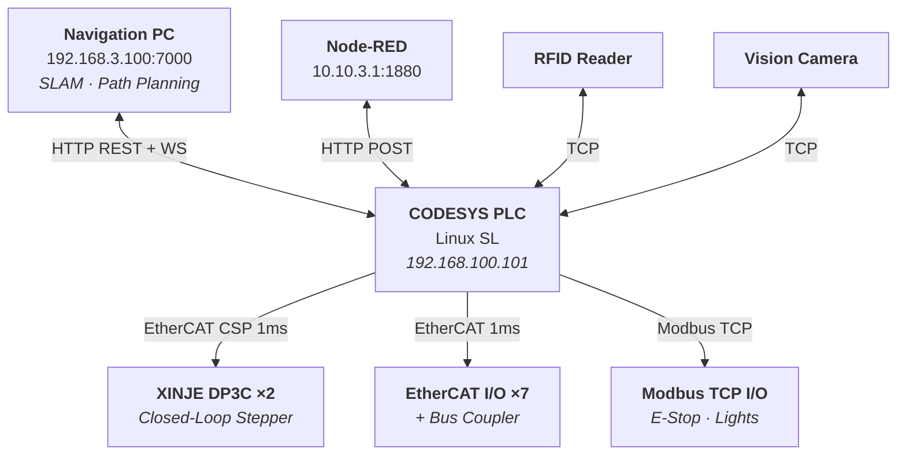
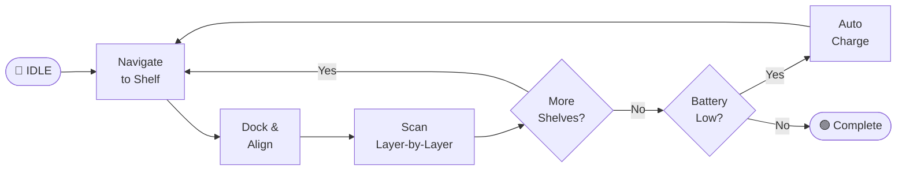

# Library Book Inventory AGV

### Real-Time Motion Control System

*Autonomous guided vehicle for automated library bookshelf inventory*
*using RFID + machine vision, built on CODESYS SoftMotion with EtherCAT fieldbus.*

---

[Architecture](#system-architecture) · [Source Code](#source-code) · [Documentation](#documentation) · [Tech Stack](#technology-stack)

 

## Overview

This project implements the complete PLC control system for a **library inventory AGV robot** that autonomously navigates between bookshelves, positions a vertical scanning mechanism at each shelf layer, and reads book RFID tags combined with machine vision for stocktaking.

<table>
<tr><td>

**What it does**

- Navigates autonomously through library aisles
- Positions a vertical lift to each shelf layer
- Triggers RFID + vision scanning per layer
- Uploads inventory data to a central database
- Manages battery and auto-charging cycles

</td><td>

**How it works**

- CODESYS PLC on Linux SL orchestrates everything
- EtherCAT drives in CSP mode at 1ms cycle
- HTTP REST API for navigation system integration
- TCP sockets for RFID reader and camera
- Web-based HMI for operator control

</td></tr>
</table>

### Key Specifications

| | |
|---|---|
| **PLC Platform** | CODESYS Control for Linux SL V4.6 |
| **Motion Library** | CODESYS SoftMotion V4.15 — 29 libraries |
| **Fieldbus** | EtherCAT with Distributed Clock synchronization |
| **Drive Protocol** | CiA 402 / DS402 — Cyclic Synchronous Position (CSP) |
| **Interpolation Cycle** | 1 ms |
| **EtherCAT Slaves** | 10 devices — 2 stepper drives + 7 I/O terminals + 1 bus coupler |
| **Protocols** | EtherCAT CoE, Modbus TCP, HTTP REST, WebSocket, TCP Socket |
| **HMI** | CODESYS Web Visualization (HTML5) |
| **Program Units** | 37 user-defined POUs |
| **Dependencies** | 179 compiled libraries |

---

## System Architecture

### Operational Workflow

---

## Source Code

> **IEC 61131-3 Structured Text** — Representative implementations illustrating the key control patterns used in this project. See [`src/README.md`](src/README.md) for context.

| File | Lines | Description |
|:-----|------:|:------------|
| [`AgvControl_FB.st`](src/agv_control/AgvControl_FB.st) | 280 | Master AGV state machine — IDLE → Navigate → Scan → Charge cycle |
| [`AxisControl_FB.st`](src/motion/AxisControl_FB.st) | 200 | Single-axis motion controller wrapping 10 MC_ function blocks |
| [`NavigationApiClient.st`](src/communication/NavigationApiClient.st) | 170 | HTTP REST client with JSON body construction |
| [`SensorTcpClient.st`](src/communication/SensorTcpClient.st) | 170 | TCP socket client for RFID/Vision with auto-reconnection |
| [`GVL_Servo.st`](src/global_variables/GVL_Servo.st) | 80 | Axis configuration — velocity/acceleration limits, presets |
| [`GVL_Main.st`](src/global_variables/GVL_Main.st) | 70 | Core application variables — waypoints, tasks, diagnostics |
| [`St_PointAxis.st`](src/data_types/St_PointAxis.st) | 80 | Data types — waypoint struct, state enums, shelf config |

---

## Documentation

Detailed technical documentation covering every subsystem:

| Document | Description |
|:---------|:------------|
| **[System Architecture](docs/system-architecture.md)** | Network topology, hardware layout, startup sequence, error codes |
| **[Motion Control](docs/motion-control.md)** | SoftMotion config, DS402 state machine, homing, trajectory planning |
| **[EtherCAT Configuration](docs/ethercat-configuration.md)** | Bus topology, PDO mapping, XINJE DP3C drive setup, 29 SM3 libraries |
| **[Communication Protocols](docs/communication-protocols.md)** | 9 REST API endpoints, WebSocket, TCP sensor protocol, Modbus I/O |
| **[State Machine](docs/state-machine.md)** | AGV control flow, scanning algorithm pseudocode, timing estimates |
| **[Safety Design](docs/safety-design.md)** | E-Stop architecture, fault recovery, battery management, position lag |
| **[HMI Interface](docs/hmi-interface.md)** | Complete reference for all 67 operator-facing variables |

---

## Configuration Files

Real hardware configuration files extracted from the deployed system:

| File | Description |
|:-----|:------------|
| [`xinje-dp3c-esi.xml`](config/xinje-dp3c-esi.xml) | EtherCAT Slave Information — drive identity, PDO definitions, DC config |
| [`xinje-dp3c-device.xml`](config/xinje-dp3c-device.xml) | CODESYS device description — SDO parameters, PDO/SDO mappings |
| [`softmotion-profile.xml`](config/softmotion-profile.xml) | SoftMotion library resolution profile — 29 motion control libraries |

---

## Technology Stack

| Layer | Components |
|:------|:-----------|
| **Application** | AGV State Machine · Inventory Scheduler · Web HMI (HTML5) |
| **Communication** | HTTP REST Client · WebSocket · TCP Client/Server · JSON Utilities SL |
| **Motion Control** | SoftMotion V4.15 · PLCopen MC_ Function Blocks (Power, Home, MoveAbsolute, Halt, Stop, Reset, Jog, SetPosition) |
| **Fieldbus** | EtherCAT Master with DC-Sync · CiA 402 / DS402 CSP Mode · Modbus TCP Master |
| **Hardware** | XINJE DP3C(L) Closed-Loop Stepper ×2 · EtherCAT I/O Terminals ×7 · Modbus Remote I/O |

---

**MIT License** — See [LICENSE](LICENSE) for details.

